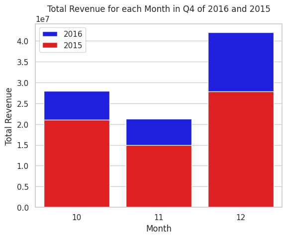

## comparison between 3 techniques

#### 1.chat with your data question answer,  
#### 2.gpt3.5  with a better prompt that has dataset description, subset for data, and columns name with its types  to generate code
#### 3.AutoGen GPT3.5 with the same prompt template  
### about the dataset 
https://www.kaggle.com/datasets/podsyp/time-series-starter-dataset
### about prompt template 
```
your task is to generate the correct Python code ready for running on Python that  matches user requirements 
 the path of data determined by 3  quotes  ```/content/Month_Value_1.csv ``` 
 ,the data you will work on  
 , the columns describtion
 the column name is {Period} the datatype is <class 'str'>
 the column name is {Revenue} the datatype is <class 'numpy.float64'>
 the column name is {Sales_quantity} the datatype is <class 'numpy.float64'>
 the column name is {Average_cost} the datatype is <class 'numpy.float64'>
 the column name is {The_average_annual_payroll_of_the_region} the datatype is <class 'numpy.float64'>
. 
```
## 1.query = can you give me total Revenue (mathematical)
### 1.chat with your data question answer (not accepted )
```
output The total revenue for the given period is 15807587.449808 + 14993369.65763 = 30800957.107438.
target output 2071068944.603248

```
### 2.gpt3.5  with a better prompt (accepted)
```
model response :

import pandas as pd

# Read the dataset
data = pd.read_csv('/content/Month_Value_1.csv')

# Calculate the total revenue
total_revenue = data['Revenue'].sum()

# Print the total revenue
print("Total Revenue:", total_revenue)

the output of the python code

Total Revenue: 2071068944.603248

```
### 3.AutoGen GPT3.5 with the same prompt template (accepted)
```
the model response 
# filename: calculate_total_revenue.py
import pandas as pd

# Read the CSV file
data = pd.read_csv('/content/Month_Value_1.csv')

# Calculate the total revenue
total_revenue = data['Revenue'].sum()

# Print the total revenue
print("Total Revenue:", total_revenue)


the output of the python code

Total Revenue: 2071068944.603248

```
## 1.query = "can you give me total Revenue in 2015 " (mathematical operation with filtration operation)

### 1.chat with your data question answer (not accepted )
```
output  I don't know. !

```
### 2.gpt3.5  with a better prompt (accepted)
```
the model response 
import pandas as pd

# Read the data from the CSV file
data = pd.read_csv('/content/Month_Value_1.csv')

# Convert the 'Period' column to datetime format
data['Period'] = pd.to_datetime(data['Period'], format='%d.%m.%Y')

# Filter the data for the year 2015
data_2015 = data[data['Period'].dt.year == 2015]

# Calculate the total revenue in 2015
total_revenue_2015 = data_2015['Revenue'].sum()

print("Total Revenue in 2015:", total_revenue_2015)


the output of the python code

Total Revenue in 2015: 222233665.56535

```
### 3.AutoGen GPT3.5 with the same prompt template (accepted)

```
# Read the CSV file
df = pd.read_csv('/content/Month_Value_1.csv')

# Convert the 'Period' column to datetime format
df['Period'] = pd.to_datetime(df['Period'], format='%d.%m.%Y')

# Filter the dataset for the year 2015
df_2015 = df[df['Period'].dt.year == 2015]

# Calculate the total revenue in 2015
total_revenue_2015 = df_2015['Revenue'].sum()

print("Total Revenue in 2015:", total_revenue_2015)

the output of the python code
Total Revenue in 2015: 222233665.56535

```
## secation 2


### 1.Query : can you give me total Revenue in every month give me the output numbers  with chart

### Technique : GPT3.5
### Output :
```
import pandas as pd
import matplotlib.pyplot as plt

# Load the dataset
data = pd.read_csv("/content/Month_Value_1.csv")

# Convert the 'Period' column to datetime
data['Period'] = pd.to_datetime(data['Period'], format='%d.%m.%Y')

# Calculate the total revenue in each month
data['Month'] = data['Period'].dt.month
monthly_revenue = data.groupby('Month')['Revenue'].sum()

# Display the output numbers
print(monthly_revenue)

# Plot the chart
plt.figure(figsize=(10, 6))
plt.bar(monthly_revenue.index, monthly_revenue.values)
plt.xlabel('Month')
plt.ylabel('Total Revenue')
plt.title('Total Revenue in Each Month')
plt.xticks(range(1, 13))
plt.show()

```
### Notes : accepated result 

### 2.Query : can you give me total Revenue in every month in 2016 give me the output numbers  with chart 
### Technique : gpt3.5 
### Output :
```

import pandas as pd
import matplotlib.pyplot as plt

# Load the dataset
data = pd.read_csv('/content/Month_Value_1.csv')

# Convert the 'Period' column to datetime type
data['Period'] = pd.to_datetime(data['Period'], format='%d.%m.%Y')

# Filter the data for the year 2016
data_2016 = data[data['Period'].dt.year == 2016]

# Calculate the total revenue in each month
monthly_revenue = data_2016.groupby(data_2016['Period'].dt.month)['Revenue'].sum()

# Visualize the data with a chart
plt.figure(figsize=(10, 6))
plt.bar(monthly_revenue.index, monthly_revenue)
plt.xlabel('Month')
plt.ylabel('Total Revenue')
plt.title('Total Revenue in Every Month in 2016')
plt.xticks(monthly_revenue.index)
plt.show()

# Print the total revenue for each month in 2016
print(monthly_revenue)

```
### Notes : accepted 
____________________________________________________
### 3.Query : can you give me  month of best Revenue  the  output should  numbers  wiht chart
### Technique : gpt3.5 
### Output :
```


import pandas as pd
import matplotlib.pyplot as plt

# Read the data
data = pd.read_csv('/content/Month_Value_1.csv')

# Convert the 'Period' column to datetime format
data['Period'] = pd.to_datetime(data['Period'], format='%d.%m.%Y')

# Sort the data by revenue in descending order
sorted_data = data.sort_values('Revenue', ascending=False)

# Get the month with the best revenue
best_month = sorted_data.iloc[0]['Period'].month

# Filter the data for the best month
best_month_data = data[data['Period'].dt.month == best_month]

# Get the revenue values for the best month
revenue_values = best_month_data['Revenue'].values

# Get the month names for the chart labels
month_names = pd.to_datetime(best_month_data['Period']).dt.strftime('%b %Y').values

# Plot the bar chart
plt.bar(month_names, revenue_values)
plt.xlabel('Month')
plt.ylabel('Revenue')
plt.title('Revenue for Each Month')
plt.xticks(rotation=45)
plt.show()

```
### Notes : get the best 5 months (accepted)

### 4.Query :can you give me total Revenue in every month in Q4 2016 give me the output numbers  with chart
### Technique : gpt3.5
### Output :
```

import pandas as pd
import matplotlib.pyplot as plt

# Load the dataset
data = pd.read_csv('/content/Month_Value_1.csv')
data['Period'] = pd.to_datetime(data['Period'], format='%d.%m.%Y')

# Filter data for Q4 2016 (October to December)
q4_2016 = data[(data['Period'].dt.year == 2016) & (data['Period'].dt.quarter == 4)]

# Calculate the total revenue in every month
revenue_by_month = q4_2016.groupby(q4_2016['Period'].dt.month)['Revenue'].sum()

# Plot the chart
revenue_by_month.plot(kind='bar', figsize=(8, 6))
plt.title('Total Revenue in Q4 2016')
plt.xlabel('Month')
plt.ylabel('Revenue')
plt.show()

# Print the output numbers
print(revenue_by_month)


```
### Notes : more advanced filtration (accepted )

### 5.Query : can you give me total Revenue in every month in Q4 2016 and 2015 give me the output numbers  with chart
### Technique : gpt3.5
### Output :

```
import pandas as pd
import matplotlib.pyplot as plt

#Load the dataset
df = pd.read_csv('/content/Month_Value_1.csv')

#Convert the 'Period' column to datetime format
df['Period'] = pd.to_datetime(df['Period'], format='%d.%m.%Y')

#Filter the data for Q4 2016 and 2015
q4_2016 = df[(df['Period'].dt.year == 2016) & (df['Period'].dt.quarter == 4)]
q4_2015 = df[(df['Period'].dt.year == 2015) & (df['Period'].dt.quarter == 4)]

# Calculate the total revenue in each month
total_revenue_2016 = q4_2016.groupby(q4_2016['Period'].dt.month)['Revenue'].sum()
total_revenue_2015 = q4_2015.groupby(q4_2015['Period'].dt.month)['Revenue'].sum()

#Plot the total revenue for Q4 2016 and 2015
plt.figure(figsize=(10, 6))

plt.plot(total_revenue_2016.index, total_revenue_2016.values, label='Q4 2016')
plt.plot(total_revenue_2015.index, total_revenue_2015.values, label='Q4 2015')

plt.xlabel('Month')
plt.ylabel('Total Revenue')
plt.title('Total Revenue in Q4 2016 and 2015')
plt.legend()

plt.show()

```

### Notes :more advanced filtration and calculation  (accepted )


### conclusion autogen get the same results of GPT3.5 but in autogen gets code without error in 100%

## secation 3 v3 arabic prompt test 

### When we use the Arabic prompt the result may be  (not accepted )
### When translating the prompt using Google Translate into English the result (accepted)

### Can you give me the total revenue for each month in Q4 of 2016 and 2015
```

import matplotlib.pyplot as plt

import pandas as pd
import seaborn as sns

# Read the data from the CSV file
data = pd.read_csv('/content/Month_Value_1.csv')

# Convert the "Period" column to datetime format
data['Period'] = pd.to_datetime(data['Period'], format='%d.%m.%Y')

# Filter the data for the months in Q4 of 2016 and 2015
q4_2016 = data[(data['Period'].dt.year == 2016) & (data['Period'].dt.quarter == 4)]
q4_2015 = data[(data['Period'].dt.year == 2015) & (data['Period'].dt.quarter == 4)]

# Group the data by month and calculate the sum of the revenue for each month
revenue_2016 = q4_2016.groupby(q4_2016['Period'].dt.month)['Revenue'].sum()
revenue_2015 = q4_2015.groupby(q4_2015['Period'].dt.month)['Revenue'].sum()

# Plot the total revenue for each month
sns.barplot(x=revenue_2016.index, y=revenue_2016.values, color='blue', label='2016')
sns.barplot(x=revenue_2015.index, y=revenue_2015.values, color='red', label='2015')

# Add labels and title to the plot
plt.xlabel('Month')
plt.ylabel('Total Revenue')
plt.title('Total Revenue for each Month in Q4 of 2016 and 2015')

# Show the plot
plt.legend()
plt.show()

output :true chart  
```

### in arabic  هل يمكن أن تعطيني إجمالي الإيرادات لكل شهر في الربع الرابع من عام 2016 و 2015
```
import matplotlib.pyplot as plt

import pandas as pd

# قراءة ملف البيانات
data = pd.read_csv('/content/Month_Value_1.csv')

# تحويل العمود 'Period' إلى تاريخ
data['Period'] = pd.to_datetime(data['Period'], format='%d.%m.%Y')

# استخراج الشهر والسنة من العمود 'Period'
data['Month'] = data['Period'].dt.month
data['Year'] = data['Period'].dt.year

# فلترة البيانات للربع الرابع من عام 2016 و 2015
filtered_data = data[(data['Year'] == 2016) & (data['Month'] >= 10) | (data['Year'] == 2015) & (data['Month'] <= 12)]

# حساب إجمالي الإيرادات لكل شهر
revenue_by_month = filtered_data.groupby(['Month', 'Year'])['Revenue'].sum().reset_index()

# طباعة إجمالي الإيرادات لكل شهر
print(revenue_by_month)


output : 
    Month  Year       Revenue
0       1  2015  1.601007e+07
1       2  2015  1.580759e+07
2       3  2015  2.204715e+07
3       4  2015  1.881458e+07
4       5  2015  1.402148e+07
5       6  2015  1.678393e+07
6       7  2015  1.916189e+07
7       8  2015  1.520498e+07
8       9  2015  2.060394e+07
9      10  2015  2.099287e+07
10     10  2016  2.791514e+07
11     11  2015  1.499337e+07
12     11  2016  2.127205e+07
13     12  2015  2.779181e+07
14     12  2016  4.201416e+07

notes : miss understand the model the the revenue in q4 in 2016 and all 2015 
```


# **concoluation**
### When we use the Arabic prompt the result (miss understand the model the the revenue in q4 in 2016 and all 2015 ) maybe ecepted or not 

### When translating the prompt using Google Translate into English the result (accepted)

### to solve this problem we used Autogenbut had a problem saving the Python code file. It doesn't work 100 % 
### response filtration save it in a Python file and run it remotely 


